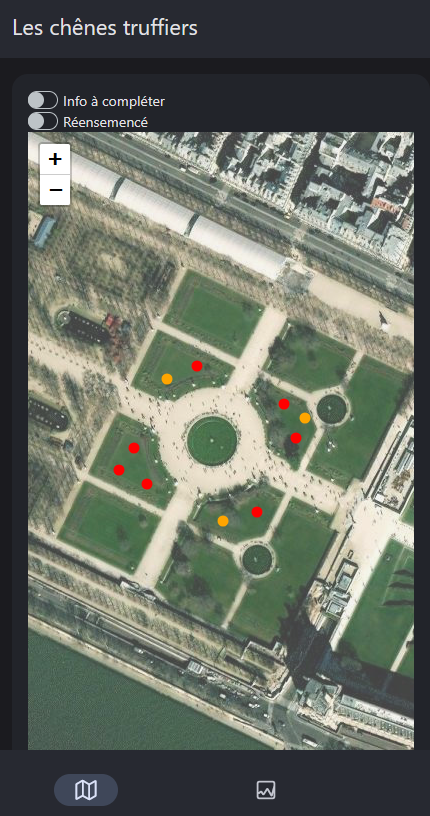
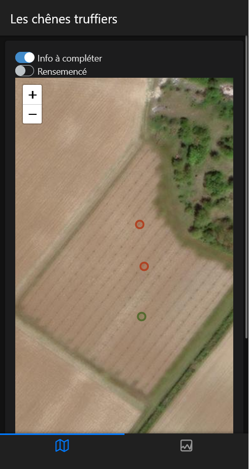
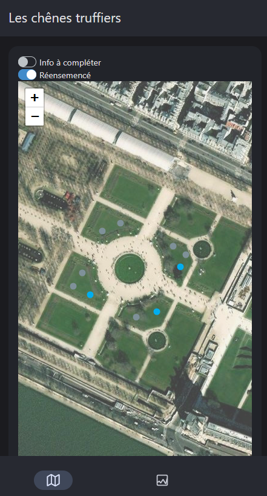
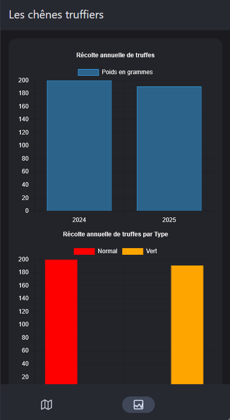

<!-- README.md is generated from README.Rmd. Please edit that file -->

```{r, include = FALSE}
knitr::opts_chunk$set(
  collapse = TRUE,
  comment = "#>",
  fig.path = "man/figures/README-",
  out.width = "100%",
  eval = FALSE
)
```

# truffles

<!-- badges: start -->
<!-- badges: end -->

R package for mapping and managing a truffle tree plantation

truffles is an R package designed to facilitate the visualization and management of a truffle tree plantation via a mobile application. With truffles, users can efficiently map a truffle tree plantation, visualize them cartographically and interactively manage truffle data.

## Features

- **Cartographic Visualization**: enables users to visualize truffle trees on a cartographic interface, providing an overview of the plantation layout.
  
- **Interactive Information Display**: Each truffle tree is clickable, allowing users to access detailed information such as planting date and total weight of truffles found.

- **Truffle Declaration and Recording**: Users can declare and record newly found truffles directly within the application. By specifying the weight of the truffle, users can maintain accurate records of truffle yields.

- **Yield Analysis**: truffles includes a dedicated tab for yield analysis, allowing users to generate graphical representations of truffle yields over different years. This feature aids in trend analysis and decision-making for orchard management.

## Installation

To install truffles, you can use the following command in your R environment:

```{r}
remotes::install_gitlab("https://gitlab.com/MurielleDelmotte/truffles")
```


## Getting Started

After installation, you can load the truffles package in R and launch the mobile application using the following commands:

```{r}
library(truffles)
run_app()
```

## Cartography tab

### Visuasilation of home page



### View information on truffles found to complete



### Visualization of reseeded truffle oak trees



## Graphics tab

### View truffle oak yields


