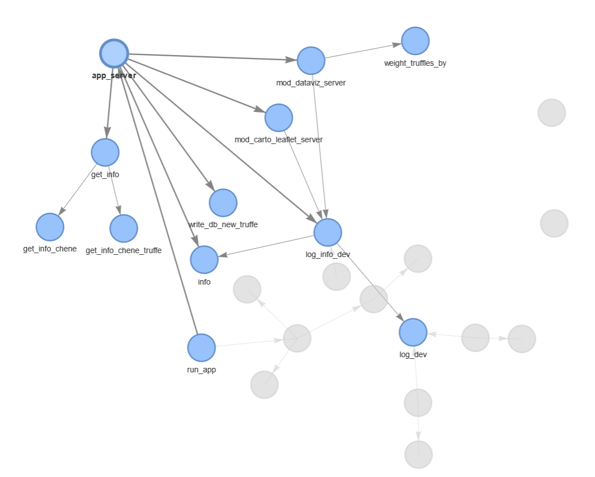

```{r, include = FALSE}
knitr::opts_chunk$set(
  collapse = TRUE,
  comment = "#>"
)
```

## Schématisation de l'application


## Visualisation des dépendances


## Visualisation des dépendances - app_server.R


